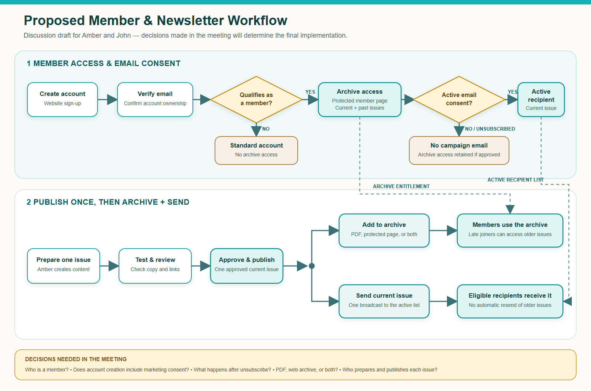

# WaistLess Foods Planning Meeting — Internal Prep

**Status:** Internal working document; do not send as the proposal\
**Meeting:** Tuesday, September 1, 2026\
**Time:** 9:30–10:30 AM Central Daylight Time / 10:30–11:30 PM WITA\
**Expected attendees:** Amber Fitzgerald, Muhammad Zulzidan M, and John Fitzgerald if available\
**Primary objective:** Agree on the intended member/newsletter and calendar workflows, establish what remains from the original website scope, and define the written next step.

## Desired Meeting Outcomes

Leave the meeting with these items recorded, even if pricing is not approved during the call:

1. One agreed list of remaining original-project obligations.
2. A precise definition of a WaistLess Foods “member.”
3. A selected newsletter archive format and publishing workflow.
4. A selected Google Calendar use case for public Events, service availability, or both.
5. Confirmation of whether Eventbrite or another external registration provider will be used.
6. Agreement that any newly defined work will be documented and approved before implementation.
7. Named owners and target dates for every client-dependent item.

## Important Evidence Position

The repository contains a careful audit of the original proposal, but it does not contain an obvious copy of the signed or accepted original SOW. Do not present the audit as the contract.

The current evidence supports these statements:

| Topic | Evidence | Safe position for the meeting |
| --- | --- | --- |
| Authentication | Sign-in, sign-up, verification, accounts, and protected purchase flows have been delivered and expanded. | A login foundation exists. “Member” status and entitlement still need definition. |
| Newsletter | Newsletter signup, welcome email, unsubscribe handling, and duplicate protection exist. | Campaign sending and a protected archive are separate behaviors that need confirmation against the source SOW. |
| Member archive | Amber described a signed-in page containing downloadable past newsletters in her August 27 email. | Treat this as the latest requested outcome, not automatically as proven original scope. Ask to review the exact SOW wording together. |
| Events | The original package broadly named an Events and Classes calendar with booking forms. Amber’s August 14 recap says Zul should provide a quote for an Events tab. | A basic Events concept was named, but “calendar,” booking behavior, registration, and acceptance criteria were not precisely defined in the materials available here. |
| Google Calendar | Amber’s August 14 recap connected Google Calendar to consultation and service-date availability. Her August 27 email asked whether it can sync with Events. | These are two different use cases. Separate them before discussing scope or price. |
| Scope changes | In the October 8, 2025 meeting, Amber acknowledged that ideas outside the scope could be discussed and clarified. | Keep the conversation collaborative. Do not retroactively invoice unapproved work; use prospective written scope. |

Historical Notion context: [October 8, 2025 WaistLess Foods meeting](https://app.notion.com/p/2861316a5ee980cd9b27d54721f268bd)

## Recommended 60-Minute Agenda

| Time | Owner | Topic | Required output |
| --- | --- | --- | --- |
| 0–5 min | Zul | Confirm the purpose of the call | Agreement on the decisions to make today |
| 5–15 min | Amber, John, Zul | Open the original SOW and identify remaining launch obligations | One original-scope closeout list |
| 15–28 min | Amber and John | Walk through the intended member and newsletter experience | Member definition, consent/list rule, archive format, and publishing owner |
| 28–43 min | Zul | Demonstrate the three Google Calendar approaches | Selected public-event and/or availability approach |
| 43–53 min | Zul, Amber, John | Separate original closeout, new fixed-scope work, and optional ongoing support | Chosen commercial path or requested revised estimate |
| 53–60 min | Zul | Read back decisions, owners, and dates | Written follow-up commitments |

## Opening Script

> Thank you both for taking the time to review this with me. I would like to use today’s call to make the remaining work very clear for everyone. First, we can open the original scope and agree on what still belongs to the current website project. Then I will map the membership/newsletter workflow and show the Google Calendar options. At the end, we can separate the original closeout from any newly defined work and agree on the next written step.

If John says the archive was included in the SOW:

> I understand, and I am not trying to dismiss that. The materials I have confirm that membership, authentication, newsletters, and Events were contemplated, but they do not clearly define the archive behavior, member eligibility, or calendar synchronization. Let’s look at the exact language together and agree on a fair completion standard.

## Membership and Newsletter Workflow to Confirm

Use this proposed flow as a discussion aid, not as an approved specification:

Editable diagram sources: [SVG](newsletter-workflow-proposed.svg) and [Mermaid](newsletter-workflow-proposed.mmd)

1. A person creates and verifies a website account.
2. The system determines whether that account qualifies as a member.
3. An eligible signed-in member can open a protected newsletter archive.
4. Amber or an administrator publishes a new newsletter issue.
5. The issue is added to the archive.
6. The new issue is emailed to eligible members who are active email recipients.
7. A later member can read or download older issues from the archive without receiving old campaigns again.
8. Unsubscribing stops marketing email but does not necessarily remove account or archive access; Amber and John must confirm this policy.

### Questions that must be answered

- Is every verified website account a member, or is membership separately approved or purchased?
- Are current newsletter subscribers automatically members?
- Does creating a member account include explicit consent to receive marketing newsletters?
- If someone unsubscribes from email, do they retain access to the archive?
- Are archived newsletters PDFs, protected web pages, or both?
- How many past newsletters must be migrated for the first release?
- Who prepares and publishes each issue?
- Should Amber edit newsletters in Contentful, an email provider, or a protected website workflow?
- Who can see delivery failures, unsubscribes, and the active recipient count?
- Is this one broadcast to all eligible recipients, with no segmentation for the first release?

### Internal recommendation

Keep three concepts separate in the implementation and proposal:

- **Account:** a person who can sign in.
- **Archive entitlement:** permission to access members-only newsletters.
- **Email consent:** permission and active status for receiving marketing messages.

Do not automatically equate all three without Amber and John explicitly choosing that policy.

## Google Calendar Options to Demonstrate

Start by saying: “Public Events and private availability solve different customer problems. We can support either or both, but they should not be treated as the same synchronization feature.”

### Option 1 — Add a public event to a visitor’s calendar

**Best for:** Cooking classes and public WaistLess Foods events.

**Customer experience:** A visitor opens the event-detail page and chooses **Add to Google Calendar** or downloads an `.ics` file. The event is copied to the visitor’s calendar. Event registration still happens through Eventbrite or another approved provider.

**Amber’s workflow:** Amber edits the event once in Contentful. The website uses its title, date, time, location, and description to prepare the calendar action.

**Advantages:** Simple, branded, low maintenance, and does not expose Amber’s private calendar or availability.

**Limit:** This is not two-way synchronization. If Amber later changes an event, a visitor’s previously saved copy may not update automatically.

**Recommendation:** Use this with the Small Events MVP. It matches the public Events need without creating a custom scheduling system. If selected, formally add the calendar action to the written deliverables; do not call it “sync.”

Google documents ways to publish a public event or let visitors save it to their calendars: [Add a calendar or calendar event to a website](https://support.google.com/calendar/answer/41207?hl=en).

### Option 2 — Google Appointment Schedule for consultations and services

**Best for:** Complimentary consultations and showing times when Amber is available for a service conversation.

**Customer experience:** The website opens or embeds a Google booking page. Customers see available appointment times, choose one, and the booking is added to Amber’s calendar. Busy calendar events can block unavailable times.

**Amber’s workflow:** Amber controls her working hours, buffers, availability, and calendar conflicts in Google Calendar.

**Advantages:** Google handles availability and prevents simple double-booking. It can be linked or embedded without building a custom booking engine.

**Limits:** This is appointment scheduling, not a public Events listing or ticket-registration system. Available features depend on the Google account’s Workspace plan.

**Recommendation:** Use this separately for consultations if the existing Google Workspace plan supports the required features. Test the real `info@waistlessfoods.com` or intended owner account during the call before promising it.

Google’s current appointment schedules support public booking pages, website links or embeds, calendar conflict checks, and automatic creation of booked appointments: [Appointment schedules overview](https://support.google.com/calendar/answer/11608416?hl=en), [share or embed an appointment schedule](https://support.google.com/calendar/answer/10733297?hl=en-SG).

### Option 3 — Custom Contentful and Google Calendar API integration

**Best for:** A later phase where an event created in one system must automatically create or update records in the other, or where the website must read availability and create bookings directly.

**Customer experience:** The experience can remain fully branded on the WaistLess Foods website.

**Amber’s workflow:** Depending on the selected source of truth, Amber edits Contentful or Google Calendar and the integration synchronizes changes.

**Advantages:** Greater automation and control.

**Limits and risks:** Requires Google authorization, secure token handling, a defined source of truth, duplicate prevention, update/delete rules, time-zone handling, privacy controls, failure recovery, and ongoing maintenance. Two-way synchronization is materially more complex than creating a one-time calendar action.

**Recommendation:** Do not include this in the first Events MVP. Estimate it only after Amber and John describe a specific operational problem that Options 1 and 2 cannot solve.

Google’s API can create events, query free/busy information, and incrementally synchronize changes, but those are separate authorized workflows: [create events](https://developers.google.com/workspace/calendar/api/guides/create-events), [Calendar API reference](https://developers.google.com/workspace/calendar/api/v3/reference), [synchronization guide](https://developers.google.com/workspace/calendar/api/guides/sync).

## Recommended Combined Direction

The most practical first release is:

- **Public Events:** Contentful-managed Events listing and detail pages, external Eventbrite registration, plus an event-level **Add to Calendar** action.
- **Consultations/service availability:** a separate Google Appointment Schedule link or embed, after checking the current Workspace account and desired booking rules.
- **Custom synchronization:** deferred unless actual usage shows that the first two approaches are insufficient.

This direction answers both meanings of “Google Calendar” without exposing a private calendar or building a two-way integration prematurely.

## Commercial Conversation

Keep the discussion in three buckets:

### 1. Original website closeout

Complete anything that the exact SOW clearly promised and record any client content or approval still required. Do not place these obligations inside a new retainer.

### 2. Newly defined projects

Use a written fixed scope for functionality whose behavior was not defined in the original agreement. Current internal options remain:

- Small Events MVP: **$400 fixed**.
- Basic newsletter sending workflow: **$400 fixed**, but it currently excludes the newly requested protected archive and entitlement logic.
- Combined Events and basic newsletter work: **$700 fixed**, before adding archive or custom calendar work.

Do not quote the protected archive or custom Calendar API work during the meeting unless the workflow has first been fully defined.

### 3. Ongoing support

After the original project is closed, offer the existing bounded option of **$300 per month for six months**, approximately five to six reserved hours per month. Present this as optional support for Contentful assistance, maintenance, small improvements, and planning—not as payment for unfinished original obligations.

## Decisions to Record During the Call

| Decision | Choice / notes | Owner | Due date |
| --- | --- | --- | --- |
| Exact SOW version reviewed |  |  |  |
| Remaining original-scope items |  |  |  |
| Definition of “member” |  |  |  |
| Account-to-email consent rule |  |  |  |
| Unsubscribe effect on archive access |  |  |  |
| Archive format | PDF / web page / both |  |  |
| Number of past issues to migrate |  |  |  |
| Newsletter publishing owner and tool |  |  |  |
| Public Events calendar option | Option 1 / none |  |  |
| Consultation availability option | Option 2 / none |  |  |
| Need for custom API sync | Yes / no / later |  |  |
| Registration provider | Eventbrite / other |  |  |
| First event and target date |  |  |  |
| Commercial next step | closeout / revised quote / retainer discussion |  |  |

## Meeting-Day Checklist

- [ ] Have Amber or John open the actual original SOW on screen or send the source file before the meeting.

- [ ] Open the current website account page and newsletter subscription flow.

- [ ] Open one representative service booking page.

- [ ] Open the current Events proposal, but explain that it will be revised only after decisions are made.

- [ ] Open Google Calendar under the intended WaistLess Foods account and verify whether **Appointment schedule** is available.

- [ ] Prepare a sample public cooking-class event with a title, date, time zone, location, description, and Eventbrite placeholder.

- [ ] Demonstrate the visitor flow for Options 1 and 2; describe Option 3 rather than building it live.

- [ ] Take notes directly in the decision table.

- [ ] End by reading every decision and owner back to Amber and John.

- [ ] Send a written recap within 24 hours; do not begin new implementation until scope and payment terms are approved where required.

## Client-Safe Agenda if Requested

**WaistLess Foods Website Planning Meeting**

1. Review the original scope and remaining launch items.
2. Confirm the intended membership and newsletter archive experience.
3. Compare Google Calendar options for Events, consultations, and service availability.
4. Agree on responsibilities, next steps, and any scope requiring a revised estimate.